# Contact Form Terraform Template

This is a simple contact form web app. Once the contact form has been submitted, the details on the form are emailed to the owner. This app uses AWS and terraform.

Website --> http://cmf-contact-me-form-app.s3-website.eu-west-2.amazonaws.com/

## Flow Diagram

User interacts with contact form on webpage hosted in S3 bucket. Submitting contact form sends post request which triggers the lambda. The lambda sends an email to website owner with contents of contact form using SES.
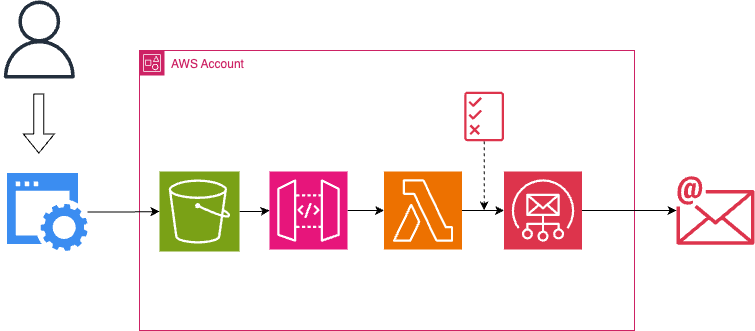

## Initial Deployment

1. Clone repo and update variables in terraform.tfvars
```
git clone git@github.com:kikidawson/tf-aws-template-contact-form.git
cd tf-aws-template-contact-form
```

2. Deploy resources via terraform.
```
terraform init
terraform plan -out=tfplan
terraform apply -auto-approve tfplan
```

3. Upload hmtl to S3 bucket by manually triggering the [HTML Code Upload workflow](https://github.com/kikidawson/tf-aws-template-contact-form/actions/workflows/html-code-upload.yaml)

4. Upload backend code to lambda function by manually triggering the [Lambda Code Upload workflow](https://github.com/kikidawson/tf-aws-template-contact-form/actions/workflows/lambda-code-upload.yaml)

5. Navigate to the [website](http://cmf-contact-me-form-app.s3-website.eu-west-2.amazonaws.com/), enter details and sumbit form, email should be recieved to the address provided in terraform.tfvars.

### AWS Management Console Screenshots
Webpage
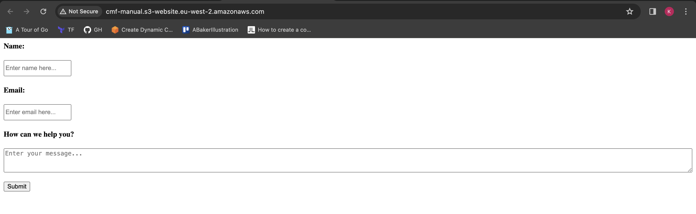

S3 Bucket
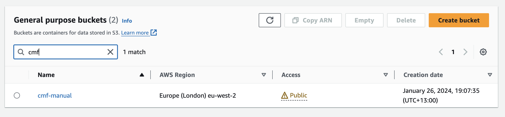

S3 Objects
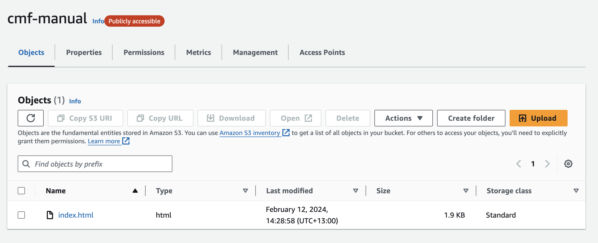

API Gateway
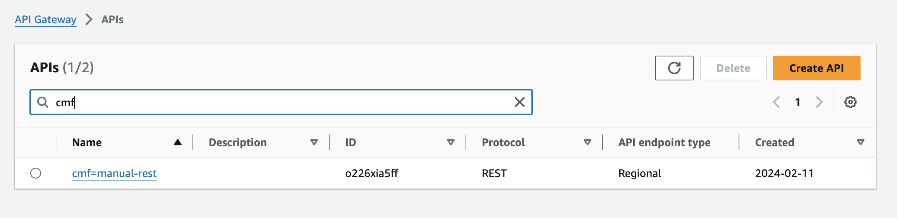

API Gateway POST
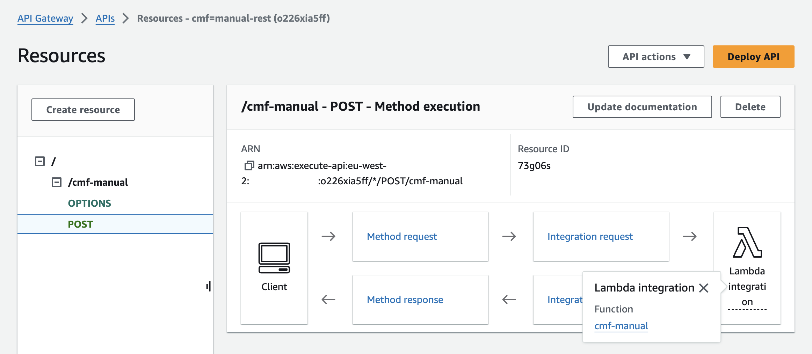

Lambda Function
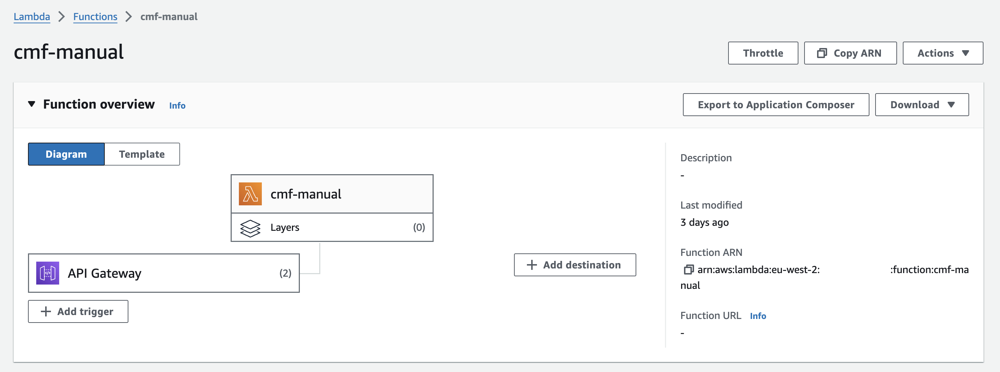

Trust Policy attached to the IAM Role
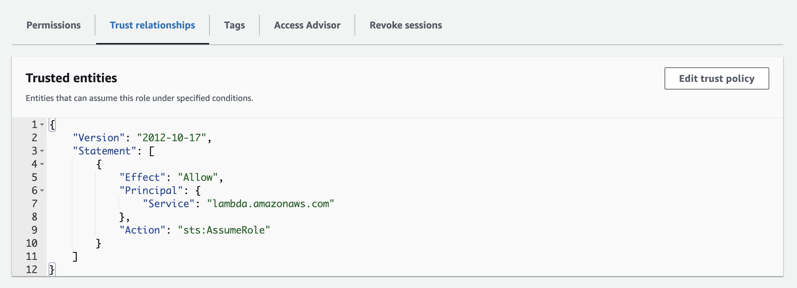

Permissions attached to the IAM Role
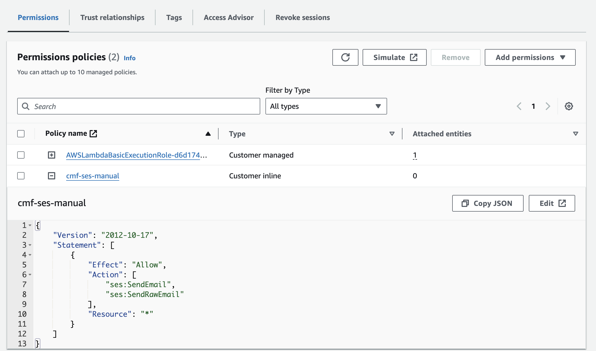

SES Identities
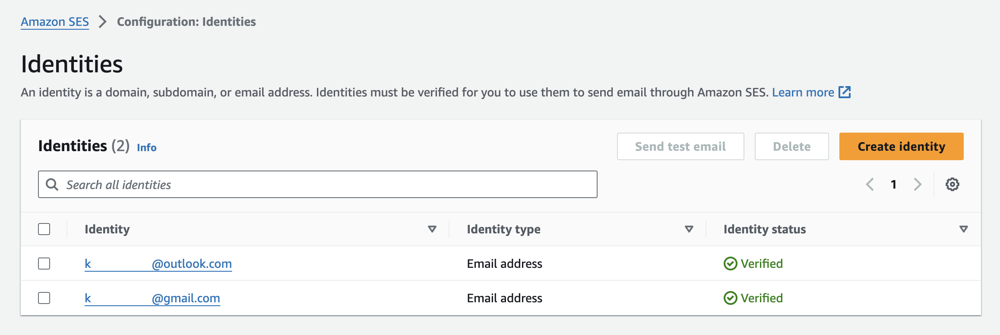

Email
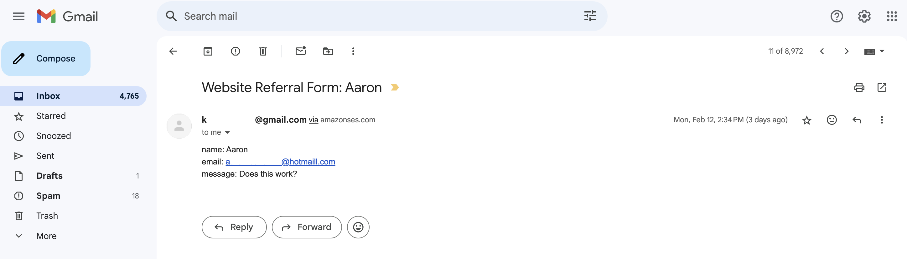

## TODO

See [GitHub issues](https://github.com/kikidawson/tf-aws-template-contact-form/issues).
